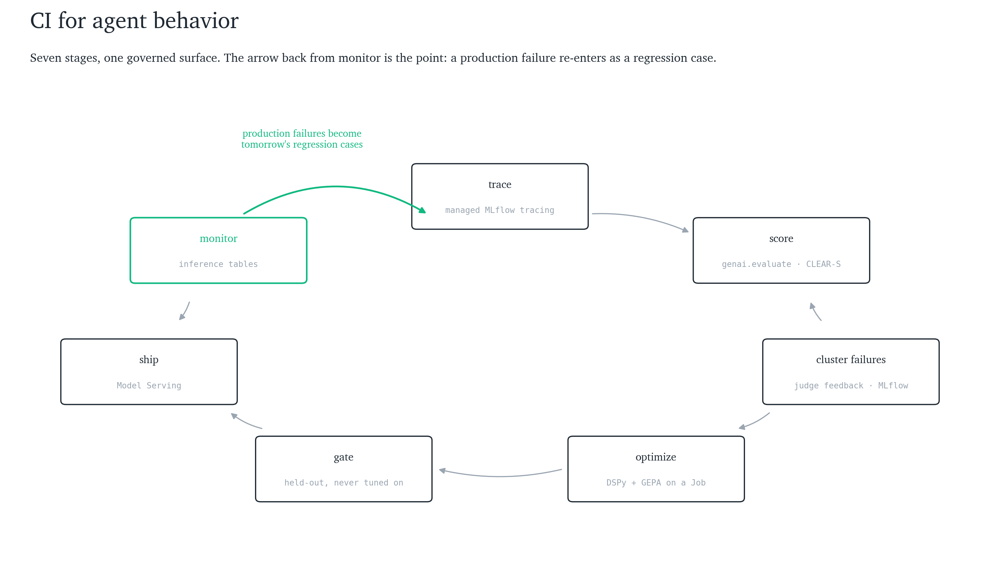

# The Agent Passed Every Demo. It Was Also Making Things Up.

*From demo to production: an eval harness that grades the trace, not the vibe.*

## TL;DR

- **A confident, well-formatted answer is not proof the agent did its job.** In a test over a real security control catalog (NIST SP 800-53), the broken agent gave citations that all pointed to real documents and read well to an automated grader, but it never actually checked those documents before citing them. What caught this was a scorer that reads the agent's step-by-step log, called a trace, rather than only its final answer.

- **Grade what the agent did, not just how the answer reads.** Our scoring system, CLEAR-S, rates each answer on seven axes: correctness, latency (speed), execution (did it take the right steps, in the right order), adherence (did it follow the instructions, format, and policy it was given), relevance, and safety, plus cost, broken out from latency so spend is visible on its own. It runs the cheap rule-based checks first, then checks the steps in the trace, then asks an LLM to judge quality. Splitting the grade keeps a problem in one area from hiding inside a single overall average.

- **The whole workflow runs on one governed platform.** A compliance agent's results are sensitive data themselves, so every trace and score needs the same access controls as the documents the agent reads. Databricks keeps all of it in one place: governance and permissions (Unity Catalog), the document search the agent uses to find evidence (Databricks AI Search, formerly Mosaic AI Vector Search), the language model behind the agent (Foundation Model APIs), and the tracing and scoring that grade each answer (MLflow). Because these share one system, any score traces back to the exact answer, source document, and model version that produced it.

---

## Why does a great demo still ship lies?

Question 89 in our SOC 2 questionnaire: *"What is your access-revocation SLA for terminated employees?"* The agent answered: *"Per our policy ACC-007 and Vendor-Mgmt v2, we revoke access within 4 hours of HR notification."*

Policy ACC-007 exists. The 4-hour SLA exists. Vendor-Mgmt v2 does not. It is the kind of phrase that gets laundered out of an old marketing email a sales engineer wrote two years ago, and it sits in our corpus as bait because we put it there. A real corpus accumulates stale claims and half-true drafts by accident; a test corpus has to carry the same traps on purpose, or the eval only rehearses the questions you already answer well. The model took the bait and turned a phrase from one document into a citation in another.

Question 102: *"Are you PCI-DSS compliant?"* The agent: *"Yes, we are PCI compliant via SAQ-D, certified annually."* We are not. Buried in the corpus, seeded by the same logic, is a draft RFP where someone wrote "we are working toward PCI compliance." The agent collapsed *working toward* into *certified*.

Both answers pass a vibe check, cite specific identifiers, and would clear review unless someone had the source documents open in a second window. Both end a security review badly and, in a regulated deal, end the deal.

The agent here is Quill: a LangGraph security-questionnaire responder over a policy corpus, traced with MLflow [[6]](#references). Quill demos beautifully on friendly inputs. Everything below is about the gap between that demo and what happens on the inputs you have not seen yet. One question runs underneath all of it:

> How do you know your agent works, on inputs you have not seen, before a customer finds out for you?

To answer that honestly, we ran the harness end to end on Databricks against a real, public control catalog, NIST SP 800-53 Rev5, so the numbers below are measured on a real standard, not a toy. Databricks is not incidental to that choice. A compliance agent's eval evidence is itself regulated data: the trace that proves the agent checked a control, and the score that grades it, have to sit under the same governance as the control catalog itself, or the proof lives outside the system that governs the thing it is proving. Every figure in this article comes from that run, and where it matters, the managed Databricks service doing the work is named as it comes up.

---

## Why does the vibe check fail at scale?

Most teams start the same way: wire up the agent, run five friendly questions, eyeball the answers, ship. That is the correct first move. The trap is that it scales worse than it looks. The vibe check works at five questions because a human reads every output. It breaks at fifty when the human tires, at five hundred when nobody can hold the corpus in their head, and by five thousand it is theater: someone samples a few rows, sees one that reads fine, and calls the run reviewed.

Worse, vibe-checking trains the wrong taste. After a week you have built an eye for plausibility, answers that *sound* right rather than answers that are right. And plausibility and correctness diverge exactly where the money is. A confident wrong answer is worse than an honest "I don't know," and the vibe loop rewards confidence. The NIST run makes this literal: the agent that never checked its citations read better to a quick reviewer than the one that did.

Ben Hylak's 2026 guide to evaluating agents [[1]](#references) draws the line that matters: the benchmark-maxxer asks what score justifies shipping, while the floor-raiser asks what the worst thing this can do is, and whether we can stop it. His litmus test: offered a choice between 90% and 99% pass rates, benchmark-maxxers pick 99% on sight; floor-raisers first want to know which 1% fails, because the failing 1% is where the business risk concentrates. This harness is a floor-raising tool. Its job is to preserve failures as regression cases you refuse to reintroduce, not to produce a leaderboard.

---

## Why score the trajectory, not the output?

A trajectory eval grades the steps an agent took to reach its answer, not only the answer itself. Where a string eval checks whether the output looks correct, a trajectory eval checks whether the agent verified each claim before stating it, called the right tools in the right order, and produced a process that would generalize rather than a correct answer that happened by luck.

Cameron Wolfe's guide to agent evaluation [[2]](#references) supplies the distinction underneath that. An agent's *output* is the text it returned. Its *outcome* is the state of the world afterward. His example: an agent that declares "the restaurant is booked!" without achieving the booking. Swap in "ticket created," "refund processed," "compliance attestation filed." Agents assert completion because their training data ends that way, with no native signal that the side effect actually happened.

Quill complicates that distinction in a useful way, because Quill has no side effects. It books nothing and files nothing; its answer is its only artifact. For an agent like that, the outcome lives one level down, in whether the process behind the output actually ran. If Quill answered correctly but never called retrieval, the correctness was luck and will not generalize. If its citations never went through a verification tool, the confidence was theater. So evaluation cannot be something you bolt onto the final string. It has to be part of the architecture, because the path the agent took is diagnostic in a way the answer is not. The evidence of the Q89 lie was never in the string, which was well-formed. It was in the tool calls that never happened.

<!-- FIGURE 1 (rendered: docs/figures/make_figures.py) -->

---

## How do we score an agent across seven axes?

Collapse a multi-dimensional system into one scalar and you lose the information that tells you how to improve it. So the harness scores on a coordinate system instead:

> **CLEAR-S** is a seven-axis scoring framework for production agents: **C**orrectness, **L**atency, **E**xecution (did the agent take the right steps, in the right order?), **A**dherence (did the output follow its instructions, format, and policy?), **R**elevance, and **S**afety, plus cost, broken out from latency as the seventh axis so spend is visible on its own. The axes stay separate. No overall average is reported, so a regression on one axis cannot hide inside a combined score.

Two of those names sound alike and are not. Execution asks whether the agent took the right steps in the right order; adherence asks whether the output obeyed the instructions, format, and policy it was given. The separation earns its keep in practice: if correctness climbs because the agent now refuses every borderline question, relevance drops and you see it.

The scorers run in layers, cheapest first, because no single scorer is complete. Three of them carry the load:

- **Deterministic checks.** Is the output well-formed, within the latency and cost budget, and does each cited ID actually resolve in the corpus? Cheap, fast, and blind to whether the answer is true. On the NIST run this layer gave both the broken and the fixed agent a perfect 1.00, because every control they cited really exists in NIST 800-53. The citations were real, which is exactly why this layer cannot be the whole story.

- **Trajectory checks.** Does every cited control carry a verification tool call that returned true? Answered from the recorded tool-call trajectory. The propose/verify/finalize structure described below is what guarantees the check ran before the answer, because the final step writes only from the verified list. This is the layer that separates an agent that *knew* its citation was good from one that *guessed* and got lucky.

- **Judge checks.** Does the cited control semantically support the claim, or does the answer overstate it ("working toward" into "certified")? This needs a model, and a model judge carries biases (position, verbosity, self-enhancement) [[3]](#references), so we keep its questions binary and itemized and calibrate against a small human-labeled set.

<!-- FIGURE 2 (rendered: docs/figures/make_figures.py) -->

We ran all of this on Databricks, and for this kind of agent that is an architecture decision, not a hosting one. Each piece of the harness maps to a managed service, and each mapping closes a governance seam:

| Harness piece | Databricks service | What the mapping buys |
|---|---|---|
| Corpus and golden sets | Unity Catalog Delta tables | Eval data carries the same permissions and lineage as production data |
| Retrieval | Databricks AI Search (formerly Mosaic AI Vector Search): a Delta Sync index with managed `databricks-gte-large-en` embeddings | The index derives from the governed table instead of living as a separately-secured copy in an outside vector store |
| Drafting and judging models | Foundation Model APIs (`databricks-gemini-2-5-flash` drafts; a second endpoint judges) | Control text never leaves the platform for an external API key |
| Model choice | The same endpoint gateway, fronting Anthropic, OpenAI, and Google frontier models alongside open-weight Qwen and Llama | Swap models per task without rewriting the agent or shipping the corpus to a new vendor; the portability sweep below is exactly that swap, run as an experiment |
| Traces and scores | Managed MLflow | Every run records the model endpoint, dataset, and variant next to its CLEAR-S scores, so a score carries the context that produced it |
| Orchestration | A Job | The whole run, data load to GEPA, reproduces as one notebook |

The reason the seams matter is the audit. For a compliance agent the eval evidence is regulated data in its own right, and on Databricks the corpus, the retrieval index, the model endpoint, the trace, and the score live under one governance model, in one workspace, behind one set of permissions. The parts run anywhere, individually. But assemble them from a warehouse plus a bolt-on vector database plus an external trace-and-eval service plus a separate model gateway, and every seam between two products becomes a governance boundary your proof-of-correctness has to cross. The trace that proves the agent verified a control would sit in a different system from the control it verified, governed by different rules, exportable by different people. That is the gap an auditor will ask about, and closing it is what the platform buys you that a pile of individually-compatible components does not.

<!-- FIGURE 3 (rendered: docs/figures/make_figures.py) -->

---

## How do we stop the agent from citing phantoms?

The naive agent asks the model, in one call, to write the answer *and* its citations. If the model invents a plausible ID, the citation looks correct, and both a vibe check and a string eval wave it through. We ran exactly this for two weeks. It failed precisely the way the opening did.

The fix is **propose, verify, finalize**, three phases in Quill's drafter:

1. **Propose.** The model emits candidate citations as JSON. It does not yet write prose.

2. **Verify.** A deterministic tool checks every candidate against the corpus. Unverifiable citations die here, and the check is recorded as a verification call in the run's tool-call trajectory.

3. **Finalize.** The model writes the answer from the *verified list only*, and the trajectory scorer then confirms every cited ID is a member of that list.

Now the trajectory scorer can confirm, from the recorded tool-call trajectory, that every citation carries a verification that returned true, and the structure guarantees the check ran before the answer was written. Here are the measured numbers on the NIST run, 20 questions, scored 0 to 1. One reading note before the table: verify-before-cite is scored as citation coverage. Each answer's score is the fraction of its cited controls that carry a successful verification call, and the table reports the average across the 20 questions.

| CLEAR-S signal | Baseline (single call) | Fixed (propose/verify/finalize) |
|---|---|---|
| Verify-before-cite (trajectory) | **0.00** | **0.97** |
| Citation resolves (deterministic) | 1.00 | 1.00 |
| Reviewer-accept (judge) | 0.58 | 0.43 |
| Execution axis | 0.50 | **0.93** |
| Safety axis | 1.00 | 1.00 |

Read the first three rows together, because they are the whole argument. The broken agent cited real controls, so the deterministic layer handed it a clean 1.00, and it read perfectly well to a quick reviewer, so the judge gave it 0.58. Yet it ran the verification step on none of its citations, and the trajectory axis says so at 0.00. It was right by luck, with a reckless process underneath. The fixed agent verifies first: 0.97 on the trajectory axis, with one question in the run whose citations never received a successful verification call, the single gap to a perfect score. And because it now refuses to overstate what a control actually says, it reads slightly worse to the same naive judge at 0.43. Score either agent on its output and you ship the dangerous one. Only the trajectory axis tells you which of the two did the work.

A note on what twenty questions can and cannot tell you. The structural rows are trustworthy at this size because the underlying check is near-deterministic: 0.00 against 0.97 is not noise, it is the difference between a graph that verifies and one that does not. The judge rows are softer. At this sample size a swing of 0.05 is roughly one borderline answer changing its mind, so read the judge for direction, not decimals. And safety sat at 1.00 for both agents, meaning that axis did no discriminating work on this corpus, which is what you want from a guardrail axis right up until the day it is not.

There is a second lesson hiding in the judge row, and it is about your data, not your agent. Both judge scores are low (0.4 to 0.6) because a generic government catalog like NIST 800-53 does not contain our company's specific evidence: the exact encryption standard, the 90-day key rotation, the named on-call process. The gold answers do. So no answer fully matches, and the judge marks everyone down. The harness surfaces that instead of hiding it: *a retrieval corpus has to actually contain your evidence*, and when it does not, the judge axis is the one that tells you.

<!-- FIGURE 4 (rendered: docs/figures/make_figures.py) -->

The pattern generalizes: wherever you can write a deterministic verifier, write one and hand it to the model as a tool, a takeaway Teresa Torres lands on from a very different domain [[4]](#references). The model is creative but inconsistent; the verifier is rigid but reliable; the loop gives you creativity bounded by correctness.

---

## Does the fix survive an unseen framework?

The verify-before-cite guarantee is structural, so it should hold on a framework the agent never saw during development. Quill's graph and prompts were built and tuned against SOC 2 questions; we then ran the same fixed agent, untouched, on a held-out ISO 27001 set, re-cited to the same NIST controls.

| CLEAR-S signal | SOC 2 (in-domain) | ISO 27001 (held out) |
|---|---|---|
| Verify-before-cite | 0.97 | **1.00** |
| Reviewer-accept (judge) | 0.43 | 0.38 |

The process transfers cleanly. On a framework it never saw, the agent verifies before citing just as reliably, a touch better even. What does not transfer for free is semantic quality. The judge slips from 0.43 to 0.38, a gap roughly one answer wide at these sample sizes, so treat the size as approximate; the direction, though, is the expected one. The scaffold removes unverified citations. It does not teach the agent a framework it has never seen. You can only see that gap because ISO 27001 was held out from this comparison. A structural fix buys you a reliable process everywhere. It does not buy you domain knowledge you never gave the agent.

---

## Does the prompt survive an optimizer and a model swap?

*GEPA did not improve this agent. That is the point.*

GEPA is a reflective prompt optimizer: it reads failing traces, writes a textual diagnosis, proposes a prompt patch, grades it against your scorers, keeps the non-dominated candidates, and repeats [[5]](#references). We ran it from Quill's production prompt, with the ISO 27001 set from the transfer test serving as its validation data. Across 41 metric calls, only one candidate, the seed itself, was ever fully scored; nothing GEPA proposed displaced it. The winner *is* the seed.

Three datasets are in play by this point, and the discipline is that they never trade places:

| Set | Job | Does GEPA see it? |
|---|---|---|
| SOC 2 development set | Built and tuned the graph and prompts; the in-domain side of the transfer test | Only indirectly: the seed prompt was written against it |
| ISO 27001, re-cited to NIST controls | Held-out framework for the transfer test, then reused as GEPA's validation set | Yes, as validation |
| SOC 2 held-out tail | The final gate; the winning candidate is checked here once, at the end | Never |

The set that gates the ship decision is the one nothing upstream ever optimized against.

Here is the lesson. GEPA optimizes prompt *text*. The win in this agent was *architectural*, the verify-before-cite scaffold, a change to the graph that no amount of wording mutation can invent. The likely reason GEPA found nothing: by the time it ran, the prompt was already sitting inside a correct graph, with little headroom left in the wording for a text optimizer to find. Two caveats keep that claim honest. Forty-one metric calls is a modest budget for a reflective optimizer, and the judge signal it climbs is noisy at this sample size, so the strict result is that GEPA found nothing at this budget, on this signal, not that no better prompt exists anywhere. The lesson survives the caveats, because it never depended on GEPA being exhaustive: a harness that can say "nothing here" is the only kind you can trust when it says "something here."

The model swap is the other half of the gate. A prompt that works on one model is a model-specific configuration until a portability sweep proves otherwise. We took the fixed Quill and swapped the drafting model from `databricks-gemini-2-5-flash` to `databricks-claude-sonnet-4-6` on the same questions.

| CLEAR-S signal | gemini-2-5-flash | claude-sonnet-4-6 |
|---|---|---|
| Verify-before-cite | 0.97 | **1.00** |
| Reviewer-accept (judge) | 0.43 | 0.53 |

The sweep confirmed the agent ports cleanly to a different model family. Verify-before-cite held, and the judge moved up as well, 0.43 to 0.53, a lean rather than a verdict at this sample size. The detail worth pausing on is `gemini-2-5-flash` itself, which scored 0.97 rather than 1.00. It is the same gap from the fix table: one question whose citations never received a successful verification call. A string eval sees none of that, since the citations look fine on the page. Only the citation-coverage check in the trajectory layer surfaces one unverified citation set, on one model, on one question. Which is the whole reason to run the sweep: not because the swap always breaks, but because you cannot know whether it did until a process-aware eval tells you.

---

## What does CI for agent behavior look like?

Trace before you eval, because you cannot grade logic you cannot see. Stack eval layers, deterministic for constraints, trajectory for logic, judge for tone. Optimize the tail, not the mean, because failures concentrate in the worst few percent of runs, and those are the runs customers remember. We built CI for code; agents need CI for behavior, and this harness is that CI: trace, score, cluster the failures, attempt to optimize, gate on an unseen set, ship, and feed every production failure back to the front of the loop.

<!-- FIGURE 5 (rendered: docs/figures/make_figures.py) -->

On Databricks, tracing, eval, governance, the optimizer loop, and the model gateway are one surface with lineage across all of it, which is the difference between a harness that demos and one a regulated team can run, audit, and stand behind when someone asks where a number came from. The full Databricks-native run in this article, data load to retrieval to agent to CLEAR-S to GEPA, is one notebook in the repository.

What this article does not cover is just as bounded as what it does. The numbers come from one agent, on one corpus, at twenty questions per comparison; the judge is calibrated against a small human-labeled set, not a large one; and the harness's failure-clustering and production-monitoring layers are described in the repository, not here. The full deep dive (every scorer, the complete CLEAR-S taxonomy, the failure-clustering and production-monitoring chapters, all the numbers) lives at [github.com/Praneeth16/eval-harness](https://github.com/Praneeth16/eval-harness).

---

## References

1. Hylak, B. *How to Eval AI Agents, The 2026 Guide*. May 2026. [howtoeval.com](https://www.howtoeval.com/)
2. Wolfe, C. *Agent Evaluation: A Detailed Guide*. Deep (Learning) Focus, May 2026. [cameronrwolfe.substack.com/p/agent-evals](https://cameronrwolfe.substack.com/p/agent-evals)
3. Zheng, L. et al. *Judging LLM-as-a-Judge with MT-Bench and Chatbot Arena*. NeurIPS 2023 (Datasets and Benchmarks). [arxiv.org/abs/2306.05685](https://arxiv.org/abs/2306.05685)
4. Torres, T. *Behind the Scenes: Building AI-Generated Opportunity Solution Trees*. Product Talk, May 2026. [producttalk.org/behind-the-scenes-ai-osts](https://www.producttalk.org/behind-the-scenes-ai-osts/)
5. Agrawal, L. A. et al. *GEPA: Reflective Prompt Evolution Can Outperform Reinforcement Learning*. 2025. [arxiv.org/abs/2507.19457](https://arxiv.org/abs/2507.19457)
6. Damji, J. *Structuring AI Evaluation and Observability with MLflow*. MLflow Blog, April 2026. [mlflow.org/blog/structured-ai-eval](https://mlflow.org/blog/structured-ai-eval/)

---

*Praneeth Paikray works at Databricks in Bangalore. Quill, the harness, and every run quoted in this article live in [the repository](https://github.com/Praneeth16/eval-harness); the Databricks-native run is a single notebook you can re-execute end to end.*
